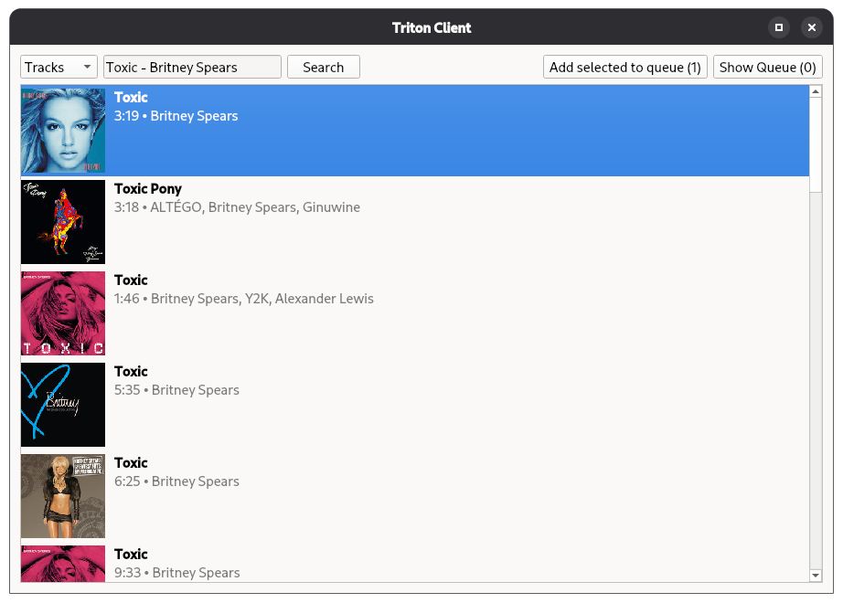
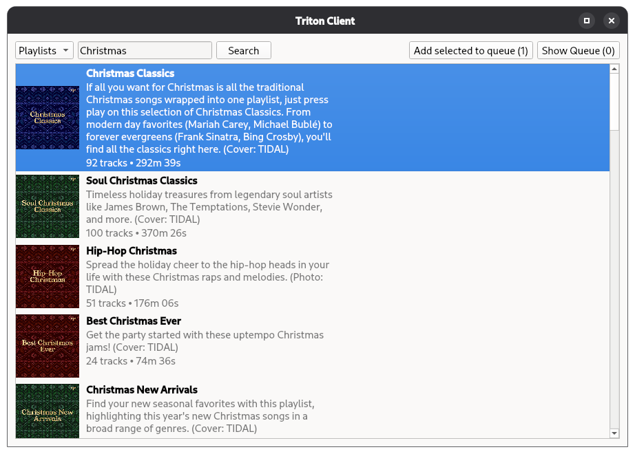
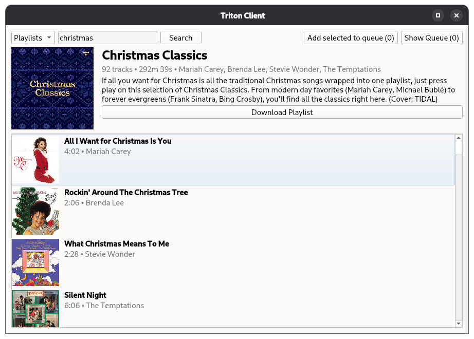
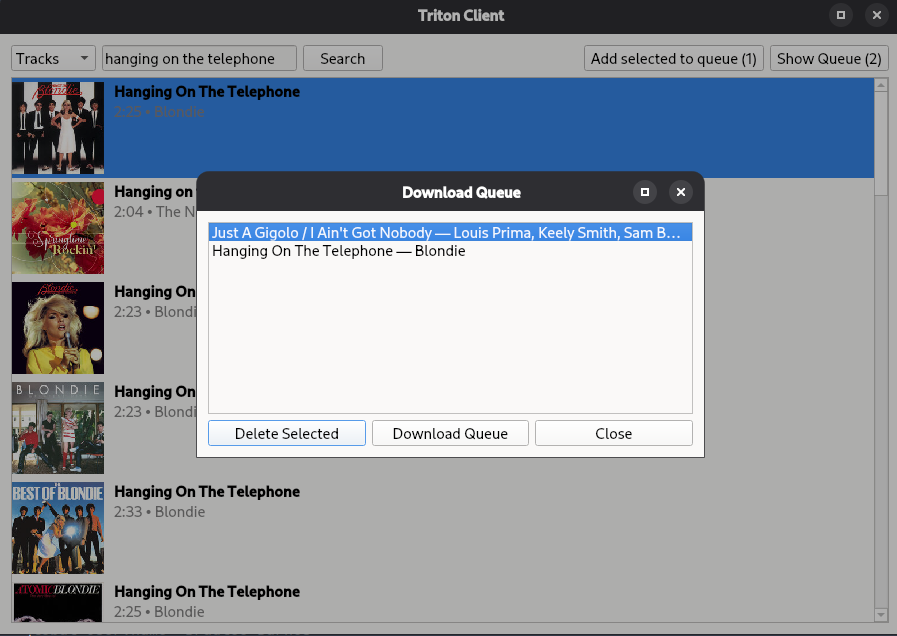
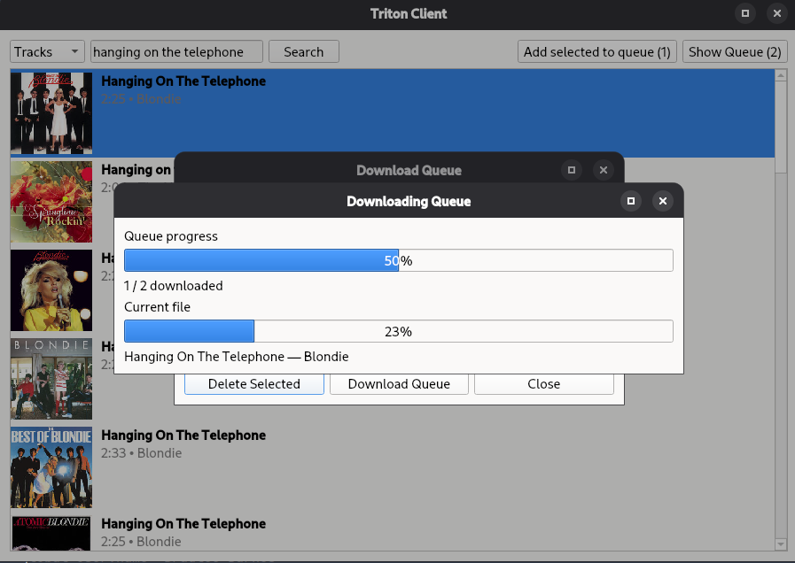
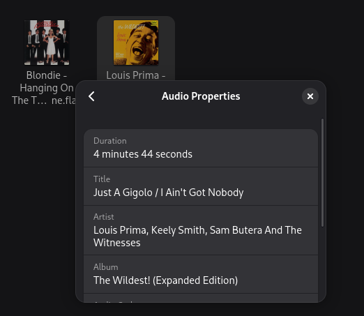

# Triton GUI Client
A (probably) cross-platform PySide6 GUI app for interacting with the [triton.squid.wtf](https://triton.squid.wtf/) API, to enjoy high-quality music offline.

## Features
- [ ] Searching
  - [x] Tracks
  - [ ] Albums
  - [ ] Artists
  - [x] Playlists
- [ ] Playback/Streaming
- [x] Downloading
    - [x] Tracks
      - [x] Metadata (Tagging)
      - [x] Cover Art
    - [ ] Albums
    - [ ] Playlists

## Installation
1. Clone the repository.
2. Create a virtual environment and activate it.
3. Install the required packages:
   - `pip install -r requirements.txt`
4. Run the application:
   - `python main.py`

## Usage
1. Launch the application.
2. Use the search bar to find tracks or playlists.
3. Switch betweens track/playlist search using the dropdown.
4. Click "Search" to display results.
5. For tracks, click one and press "Add to Queue" or click & drag to select multiple songs.
    - Shift-clicking works too, to select multiple tracks.
6. Click "Add selected to Queue" to add selected tracks to the playback queue.
7. When done selecting tracks, click "Show Queue" and then "Download Queue" to download all queued tracks.
8. Downloaded tracks will be saved in the user's `Downloads` folder with proper metadata and cover art.
9. Enjoy your music!

## Notes
- To download all music in a playlist:
    1. Find the playlist.
    2. Double-click it to open it.
    3. Click on the first track, and then press `Ctrl + A` (or `Cmd + A` on Mac) to select all tracks.
    4. Click "Add selected to Queue".
    5. Proceed to download the queue as usual.

## Screenshots
| Title                                | Image                                                           |
|--------------------------------------|-----------------------------------------------------------------|
| **Main Window (Track view)**         |         |
| **Main Window (Playlist view)**      |   |
| **Playlist opened (double-clicked)** |  |
| **Queue**                            |                               |
| **Queue (Downloading)**              |              |
| **Metadata Tagging Showoff**         |            |

## Credits
- Me, for making this.
- [@uimaxbai](https://github.com/uimaxbai), for providing [the API](https://github.com/uimaxbai/hifi-api).
- [PySide6](https://pypi.org/project/PySide6/), for the GUI.